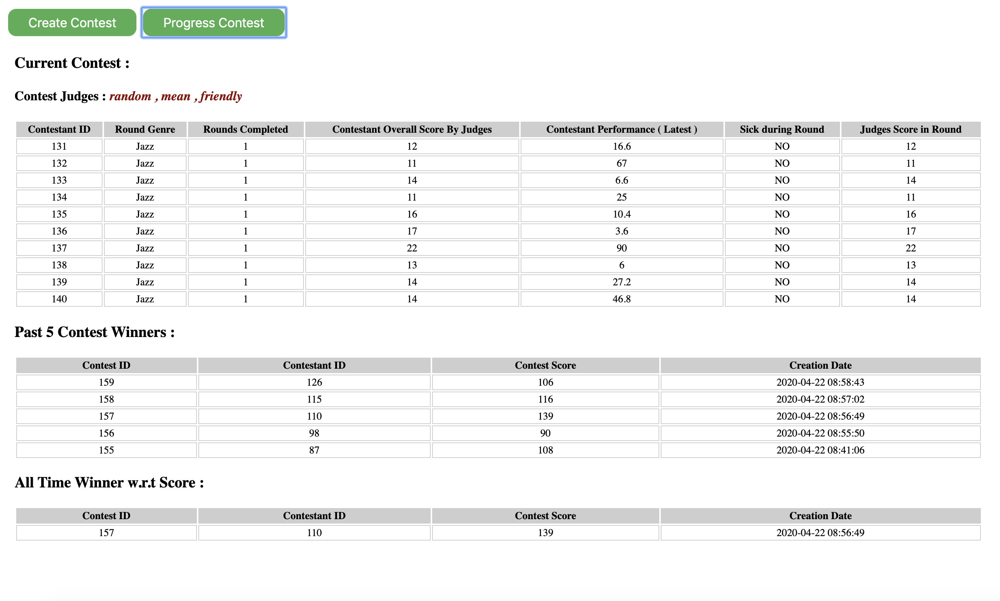
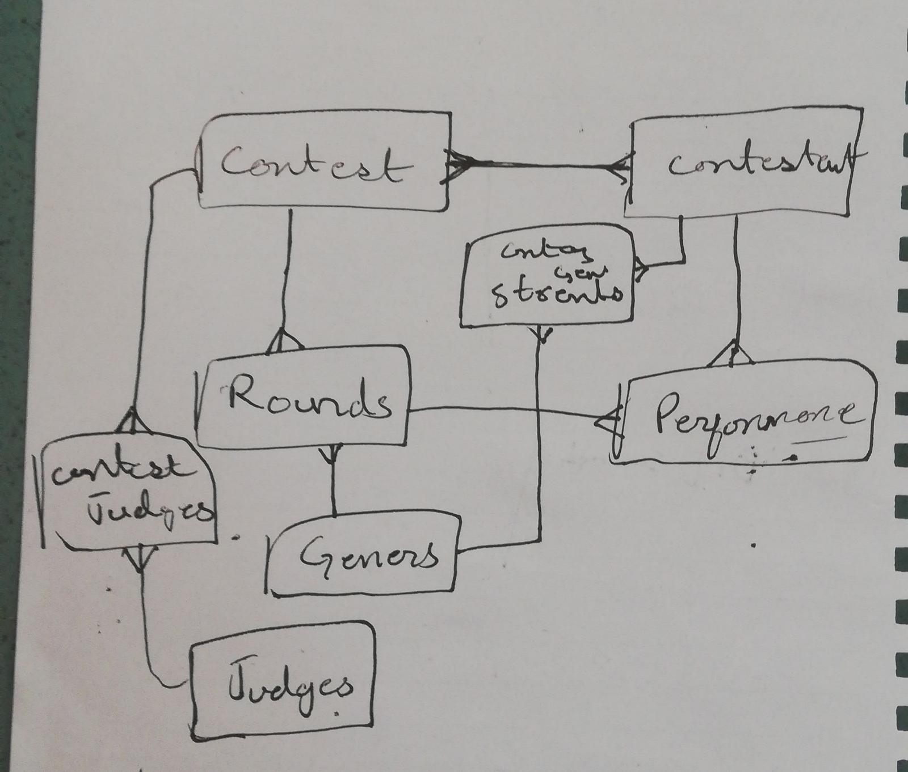

# Singing Contest Simulation
A php web application that simulates singing competition. 

## Features

- A "create contest" service which generates a new contest of 6 rounds and 10 contestants
- A "progress" service execute signing performances of all the contestants  
- It returns contestant_id, genre, rounds completed, total score, score in current round
- Note : The score shown is sum of the scores given by the contest judges panel according to their scoring criteria 
- The last 5 contest winner
- All time winner based on scores, it there are mor contestants with same highest score then all will be shown

## Requirements

- PHP 7.4

## Installation

Clone repository to your server

git clone https://github.com/BilalGill/singing-contest-simulation.git

Create mysql Database
Query : CREATE DATABASE singing-contest; (where "singing-contest" is db_name)

Run Database Schema
Path : Database/Migration/singing-contest-schema.sql

composer install

## Assumptions

- You already have setup Apache2, PHP and mysql database on system
- For every contest new contestants are generated 

## Usage Examples (on localhost)

- http://localhost/singing-contest-simulation/public/
- http://localhost/singing-contest-simulation/public/contest
- http://localhost/singing-contest-simulation/public/progress
- http://localhost/singing-contest-simulation/public/GetCurrentContest
- http://localhost/singing-contest-simulation/public/ContestHistory/getPreviousContestWinners

## Variation:

- You can also run by any number of contestants but by default it is 10. You can configure it from /App/Config/Constant "NUMBERS_OF_CONTESTANT".
- You can also run by any number of judges but by default it is 3. You can configure it from /App/Config/Constant "NUMBERS_OF_JUDGES_FOR_CONTEST".

## Assignment Specific Work Directories:
  These are the files where I have done my work related to this assignment and all other directories are generated by framework Codeignitor.
- |-- app
-        |-- Controllers
-        |-- Config
-            |-- autoload
-            |-- config
-            |-- constants
-            |-- database
-        |-- Views
-        |-- Models
-        |-- Entities
-        |-- Services                  

## Configuration Note
- If you changed the directory name of this application then you have to update "$config['base_url']" in "app/config/App.php" file

## Demo
- This is how application looks like

- Entity Relationship Diagram (Initial)

## Contribute

Create your own feature branch, commit open PR. Better to add tests related to your code.

### Testing
For running tests (if phpunit is already setup on system), just run following command in root directory.
phpunit

